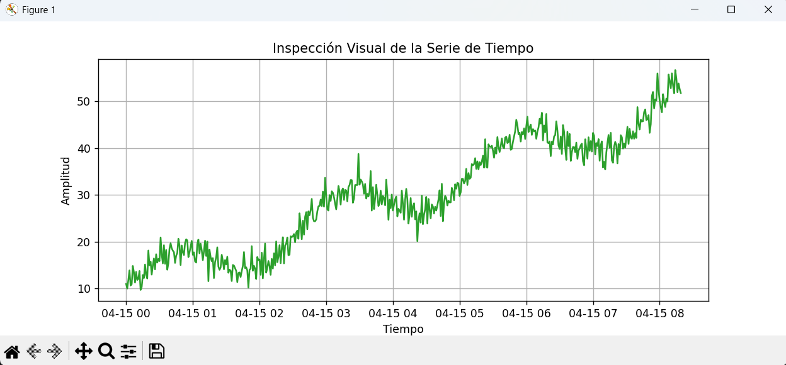
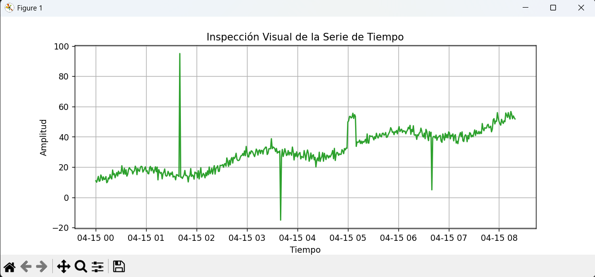

## PRÁCTICA CERO: ANATOMÍA Y ANÁLISIS DE UN DATASET
**Orozco Mora Jorge Alexander**  
*NC: 22120703*

---
### Fase 1: Análisis de Casos (Búsqueda vs. Creación)

Los alumnos deben discutir y contrastar metodologías de obtención de
datos mediante dos escenarios de ingeniería.

- *Escenario A (Búsqueda e Integración):* Se requiere predecir la
 demanda eléctrica en Michoacán para el próximo mes. Los datos ya
 existen de forma pública (ej. reportes del CENACE o bases meteorológicas).  
 /Reto principal:/ Limpieza de datos (data wrangling), alineación
  de diferentes fuentes (cruzar temperaturas con MW/h), manejo de
  valores nulos (NaN) y resolución temporal inconsistente.
- *Escenario B (Creación e Instrumentación):* Se requiere predecir el
comportamiento térmico de una estructura metálica específica
mientras es sometida a soldadura o estrés mecánico. No existe un
dataset en internet para esta pieza exacta.  
  /Reto principal:/ Adquisición de señales. Implica seleccionar
  hardware (termopares), definir la frecuencia de muestreo, lidiar
  con el ruido electromagnético de la máquina de soldar y asegurar
  la fidelidad física del dato.
 
--- 

### Fase 2: Análisis Exploratorio de Datos (EDA) con Python

Una vez comprendido el origen, los alumnos deben realizar un "Sanity
Check" a un dataset. Se les proporcionará un script base para analizar
una serie de tiempo sintética (o real, si ya cuentan con una) antes de
siquiera pensar en Keras o PyTorch.

*Instrucción:* Ejecutar el siguiente script para realizar una
inspección estadística y visual de la señal. El alumno debe modificar
el código para inyectar anomalías intencionales y ver cómo se reflejan
en las métricas.
~~~
# CODIGO SIN ANOMALIAS
import pandas as pd
import matplotlib.pyplot as plt
import seaborn as sns
import numpy as np

# 1. Generación/Carga de Datos (Simulando un sensor con ruido y tendencia)
np.random.seed(42)
# Usamos una ventana de tiempo representativa
tiempo = pd.date_range(start='2026-04-15', periods=500, freq='T')

# Señal: Tendencia base + oscilación + ruido gaussiano
valores = np.linspace(10, 50, 500) + np.sin(np.linspace(0, 20, 500))*5 + np.random.normal(0, 2, 500)

df = pd.DataFrame({'Timestamp': tiempo, 'Lectura': valores})
df.set_index('Timestamp', inplace=True)

# 2. Inspección Temporal (¿Hay valores atípicos o estacionalidad?)
plt.figure(figsize=(10, 4))
plt.plot(df.index, df['Lectura'], label='Señal Cruda del Sensor', color='#2ca02c')
plt.title("Inspección Visual de la Serie de Tiempo")
plt.xlabel("Tiempo")
plt.ylabel("Amplitud")
plt.grid(True)
plt.show()

# 3. Análisis de Distribución (¿El ruido es normal?)
plt.figure(figsize=(6, 4))
sns.histplot(df['Lectura'], kde=True, bins=30)
plt.title("Histograma y Densidad de las Lecturas")
plt.show()

# 4. Estadística Descriptiva (El perfil del dataset)
print("=== Perfil Estadístico del Dataset ===")
print(df.describe())
~~~

~~~
# CODIGO CON ANOMALIAS
import pandas as pd
import matplotlib.pyplot as plt
import seaborn as sns
import numpy as np

# 1. Generación/Carga de Datos (Simulando un sensor con ruido y tendencia)
np.random.seed(42)
# Usamos una ventana de tiempo representativa
tiempo = pd.date_range(start='2026-04-15', periods=500, freq='T')

# Señal: Tendencia base + oscilación + ruido gaussiano
valores = np.linspace(10, 50, 500) + np.sin(np.linspace(0, 20, 500))*5 + np.random.normal(0, 2, 500)

df = pd.DataFrame({'Timestamp': tiempo, 'Lectura': valores})
df.set_index('Timestamp', inplace=True)

# Copia opcional del dataset original
df_anom = df.copy()

# Inyección de anomalías
df_anom.iloc[100, 0] = 95      # pico alto
df_anom.iloc[220, 0] = -15     # pico bajo
df_anom.iloc[300:310, 0] += 20 # tramo alterado
df_anom.iloc[400, 0] = 5       # caída brusca

# 2. Inspección Temporal (¿Hay valores atípicos o estacionalidad?)
plt.figure(figsize=(10, 4))
plt.plot(df_anom.index, df_anom['Lectura'], label='Señal Cruda del Sensor', color='#2ca02c')
plt.title("Inspección Visual de la Serie de Tiempo")
plt.xlabel("Tiempo")
plt.ylabel("Amplitud")
plt.grid(True)
plt.show()

# 3. Análisis de Distribución (¿El ruido es normal?)
plt.figure(figsize=(6, 4))
sns.histplot(df_anom['Lectura'], kde=True, bins=30)
plt.title("Histograma y Densidad de las Lecturas")
plt.show()

# 4. Estadística Descriptiva (El perfil del dataset)
print("=== Perfil Estadístico del Dataset ===")
print(df_anom.describe())
~~~

---

### Fase 3: Entregable y Conclusiones Críticas

Basándose en la ejecución del código y el análisis de las gráficas, el
alumno debe redactar un reporte en su entorno de trabajo (Jupyter)
respondiendo:

  1. **Observando la gráfica temporal: ¿La serie de tiempo es estacionaria
     (su media y varianza son constantes)? ¿Por qué esto es un factor
     crítico antes de entrenar un modelo predictivo?** La serie de tiempo no es estacionaria. Esto se observa claramente en la gráfica, donde la media cambia con el tiempo debido a una tendencia ascendente, ya que la señal comienza cerca de 10 y termina por encima de 50. Además, existen oscilaciones periódicas y aparecen picos atípicos muy altos junto con caídas bruscas, lo cual altera la varianza. Como consecuencia, la dispersión de los datos no permanece constante a lo largo del tiempo.
Esto es importante antes de entrenar un modelo predictivo, ya que muchos modelos estadísticos y de Machine Learning funcionan mejor cuando los datos mantienen patrones estables. Si la serie no es estacionaria, el modelo puede confundir la tendencia con el comportamiento real, aprender patrones falsos y generar predicciones futuras poco confiables. También existe el riesgo de sobreajustarse a eventos temporales y de que el entrenamiento se vuelva inestable.
Por esta razón, normalmente se aplican técnicas de preprocesamiento como la normalización, la diferenciación, la eliminación de tendencia, el suavizado y el tratamiento de valores atípicos antes de entrenar el modelo.

  2. **En el mundo real, si tú hubieras construido el circuito para
     capturar este dataset (Escenario B), ¿qué factores físicos del
     entorno podrían generar "picos" atípicos (outliers) en las
     lecturas?** Entre las posibles razones se encuentra la interferencia eléctrica generada por motores cercanos, máquinas de soldar, variaciones de voltaje o campos electromagnéticos que afecten la señal del sensor. También podrían existir problemas propios del sensor, como que esté flojo, presente un falso contacto, tenga un cable dañado o una mala conexión a tierra.
Otra posibilidad es que el ambiente físico influya en las mediciones, por ejemplo, mediante golpes o vibraciones, cambios bruscos de temperatura, corrientes de aire caliente o humedad. Asimismo, podrían presentarse problemas electrónicos como saturación del convertidor analógico-digital (ADC), mala calibración, ruido térmico del circuito o una fuente de alimentación inestable. Finalmente, no se descarta el error humano, como una manipulación accidental o el movimiento del sensor durante la medición, lo cual también puede generar lecturas anómalas.

  3. **¿Qué riesgos corremos como ingenieros si saltamos esta fase de
     análisis y conectamos directamente estos datos crudos a una Red
     Neuronal?**   
     - **Riesgo 1: Aprender ruido en vez de patrones reales.** La red puede creer que los picos extremos son normales.
	 - **Riesgo 2: Predicciones erróneas.** El modelo responderá mal ante datos nuevos.
	 - **Riesgo 3: Sobreajuste.** Memoriza errores del dataset en lugar de generalizar.
	 - **Riesgo 4: Entrenamiento inestable.** Outliers pueden provocar gradientes muy grandes o lentitud.
	 - **Riesgo 5: Decisiones peligrosas en ingeniería.** Si controla temperatura, energía o maquinaria, puede causar fallas reales.
	 - **Riesgo 6: Pérdida de tiempo y recursos.** Entrenar redes neuronales con datos malos desperdicia cómputo.